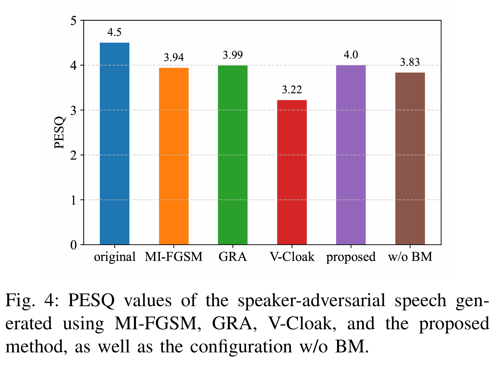
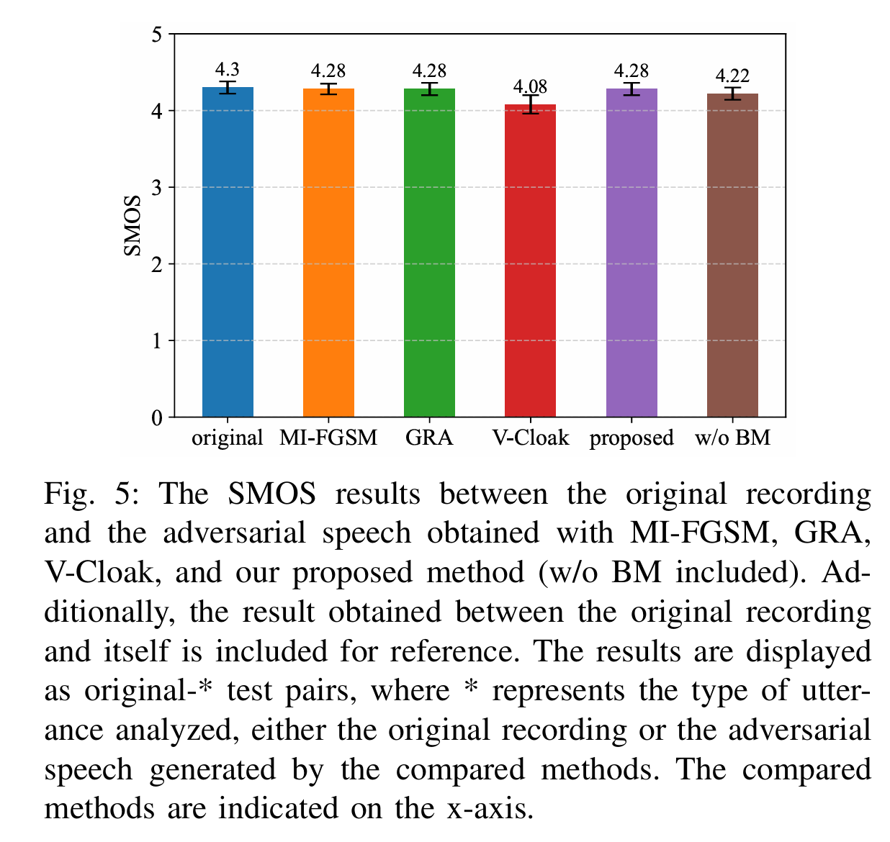
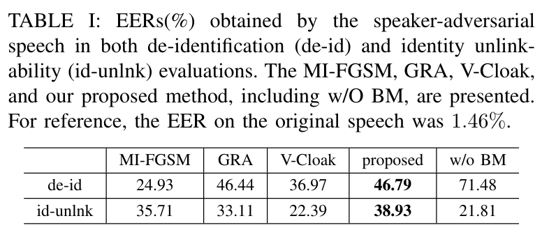
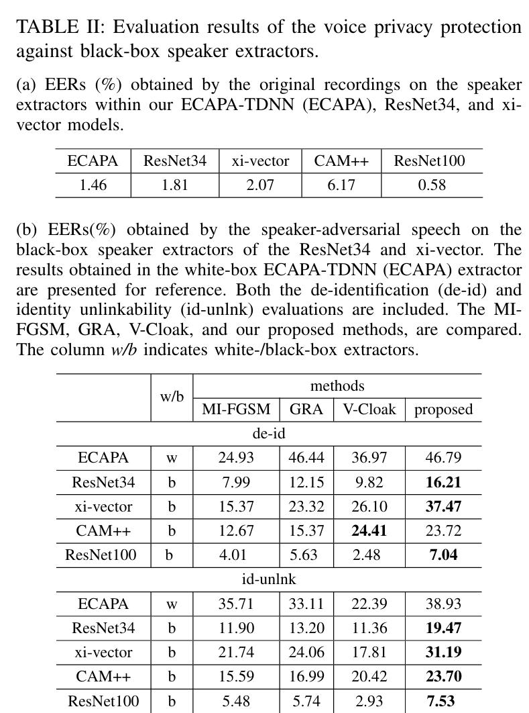

# Demo Samples
Demo samples can be found on https://voiceprivacy.github.io/any-to-any-speaker-attribute-perturbation

# Project Overview
This project implements an Any-to-Any speech anonymization method. The approach constructs a batch-average speaker as a pseudo-speaker and then anonymizes speech to this pseudo-speaker, thereby improving unlinkability. To protect AI privacy, we do not provide the training scripts and only release the inference scripts.

Additionally, this repository serves as a supplement to the paper titled *Any-to-Any Speaker Attribute Perturbation for Asynchronous Voice Anonymization*.

## Result

### Table I: PESQ
<p align="center">
  
</p>

### Table Ⅱ: SMOS
<p align="center">

</p>

### Table Ⅲ: EER (White Box)
<p align="center">

</p>

### Table Ⅳ: EER (Black Box)
<p align="center">

</p>

## Install Dependencies
Before inference, make sure to install the required dependencies. First, create a virtual environment using conda:
```bash
conda create -n a2a python=3.9
conda activate a2a
```
Then proceed with the following steps:
```bash
git clone https://github.com/VoicePrivacy/any-to-any-speaker-attribute-perturbation.git
cd any-to-any-speaker-attribute-perturbation
pip install -r requirements.txt
```
The inference process can be completed after the virtual environment is installed.

## Inference Praparation
We only need to prepare the WAV files for inference.


## Start Inference
The model can be downloaded at the link https://huggingface.co/Yonger123/ecapa_adv/tree/main. Put it in root dir. Specify the original sample path and the output anonymized speech path. Enter the following command in the command line:
```
python inference.py \
    --original_dir original_sample.wav \ 
    --adversarial_dir output_sample.wav
```
You can get anonymized speech.